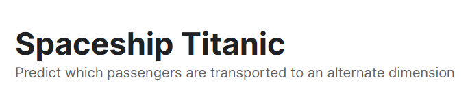

# Projeto: Machine Learning no Kaggle

## Objetivo:

Resolvendo a competição de predição **[Spaceship Titanic](https://www.kaggle.com/competitions/spaceship-titanic/overview)**:

## Feito por:

João Victor Ferrareis Ribeiro